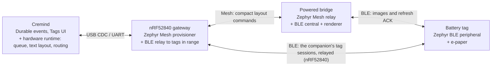

# Architecture



The gateway is plugged into a computer running Cremind: the Cremind server
itself, or a Cremind desktop app set up as a gateway computer for a server
elsewhere. The protocol documents call that host software the *companion*.

## Fixed stack decisions

| Layer | Selection |
|---|---|
| SDK | nRF Connect SDK v3.4.1 and its toolchain (`ghcr.io/nrfconnect/sdk-nrf-toolchain:v3.4.1`) |
| RTOS | Zephyr (NCS-bundled revision `ncs-v3.4.1`) |
| Bluetooth Host | Zephyr GAP/GATT/ATT/L2CAP |
| Bluetooth Mesh | Zephyr Mesh (provisioning, configuration, transport, vendor models) |
| Bluetooth Controller | Zephyr split software Link Layer, `CONFIG_BT_LL_SW_SPLIT=y` on **every** target |
| Host software | Cremind (Python, HarfBuzz, ICU, FreeType) — not in this repository |

The SoftDevice Controller and MPSL are never linked. `tools/verify_stack.py`
checks every build's resolved Kconfig, devicetree and link map, and CI fails
otherwise. Blocked targets stay documented as blocked; another controller is
never substituted to make a target pass.

## Division of work

| Stage | Does | Never does |
|---|---|---|
| Cremind | Journals profile events in the source transaction; projects them into delivery jobs; its hardware runtime turns them into screens (Unicode layout with ICU + HarfBuzz), keeps the durable queue, speaks the gateway serial protocol, enrolls and flashes hardware, builds font packs; for tags on the gateway's own radio it runs the bridge side of the tag session and renders the frame itself ([protocol.md §11](protocol.md#11-tags-on-the-gateways-own-radio)); UI/CLI/API | Rendering pixels for tags behind a bridge (the bridge does that) |
| Gateway | Mesh provisioner + configuration client; persists the network; injects layouts; returns results; on the nRF52840 also a BLE relay to the tags in its own range (connects under the bridge's §5.2 rules, carries whole session messages, fragmented per §5.3) | Rendering, holding tag keys, looking into relayed messages |
| Bridge | Mesh relay; validates layouts; strip-renders bitmaps from its font pack; BLE central to tags; authenticated image transfer | Holding tag secrets |
| Tag | Advertises briefly every 30 s; authenticates the bridge; writes authenticated image records into panel RAM; refreshes only after full validation; persists the result before ACKing | Fonts, layout, mesh |

## The protocol contract

`protocol/spec.yaml` is the single source of truth for identifiers and
limits; `tools/codegen.py` generates the firmware's C bindings from it. Host
software never reads this checkout: it pins the **contract artifact**
`tools/contract.py` builds from a commit — the spec, the golden fixtures, the
tag core conversations (`tests/conversation.h`), the hardware tables
(`hardware/matrix.yaml`, `tools/targets.yaml`) and the normative protocol
documents, each with its SHA-256, plus one digest over them all. A release
publishes it next to the firmware ([releasing](releasing.md)).

The fixtures and `tests/ztest/tag_core/src/conversation.h` are produced by the
host's Python reference implementation (Cremind's `scripts/tags/gen_fixtures.py`
and `gen_conversation.py`) and committed here, where the host C tests and
twister check the firmware against them byte for byte.

## Repository layout

```
protocol/            spec.yaml (single source of truth) + golden fixtures shared with the host software
include/ctag/        generated protocol headers + public headers of the firmware libraries
lib/                 firmware libraries (portable C, host-testable): framing, layout, render, session, tag txn, fontpack, qr, connection scheduler
apps/gateway|bridge|tag   Zephyr applications (and their native_sim tests)
boards/cremind/      HWMv2 boards for the four EPD tag boards
dts/bindings/        panel and board bindings
zephyr/module.yml    makes this repo a Zephyr module (boards, dts, lib)
hardware/            matrix.yaml: boards, panels and their qualification status
tools/               codegen, stack verification, build matrix, contract, versions, release, reproducibility
pyproject.toml       the tools' Python environment (uv)
tests/host/          host-compiled C tests against protocol/fixtures
tests/ztest/         Zephyr test suites (native_sim)
tests/tools/         tests of tools/
docs/                protocols, security, firmware, hardware matrix, qualification reports
```
