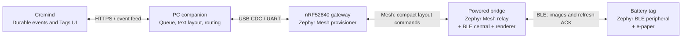

# Architecture



## Fixed stack decisions

| Layer | Selection |
|---|---|
| SDK | nRF Connect SDK v3.4.1 and its toolchain (`ghcr.io/nrfconnect/sdk-nrf-toolchain:v3.4.1`) |
| RTOS | Zephyr (NCS-bundled revision `ncs-v3.4.1`) |
| Bluetooth Host | Zephyr GAP/GATT/ATT/L2CAP |
| Bluetooth Mesh | Zephyr Mesh (provisioning, configuration, transport, vendor models) |
| Bluetooth Controller | Zephyr split software Link Layer, `CONFIG_BT_LL_SW_SPLIT=y` on **every** target |
| Companion | Python 3.13+, HarfBuzz, ICU, FreeType |

The SoftDevice Controller and MPSL are never linked. `tools/verify_stack.py`
checks every build's resolved Kconfig, devicetree and link map, and CI fails
otherwise. Blocked targets stay documented as blocked; another controller is
never substituted to make a target pass.

## Division of work

| Stage | Does | Never does |
|---|---|---|
| Cremind | Journals profile events in the source transaction; projects them into delivery jobs with a normalised card; tracks stages; UI/CLI/API | Text layout, device protocols |
| Companion | Profile policy/routing results → screens; Unicode layout (ICU + HarfBuzz); durable SQLite queue; gateway serial protocol; enrollment; font packs | Rendering pixels for delivery (bridges do that) |
| Gateway | Mesh provisioner + configuration client; persists the network; injects layouts; returns results | Rendering, BLE connections to tags |
| Bridge | Mesh relay; validates layouts; strip-renders bitmaps from its font pack; BLE central to tags; authenticated image transfer | Holding tag secrets |
| Tag | Advertises briefly every 30 s; authenticates the bridge; writes authenticated image records into panel RAM; refreshes only after full validation; persists the result before ACKing | Fonts, layout, mesh |

## Repository layout

```
protocol/            spec.yaml (single source of truth) + fixtures shared by C and Python
include/ctag/        generated protocol headers + public headers of the firmware libraries
lib/                 firmware libraries (portable C, host-testable): framing, layout, render, session, tag txn, fontpack, qr
apps/gateway|bridge|tag   Zephyr applications
boards/cremind/      HWMv2 boards for the four EPD tag boards
dts/bindings/        panel and board bindings
snippets/            controller-selection snippets for targets without bt_hci_sdc
zephyr/module.yml    makes this repo a Zephyr module (boards, dts, lib)
companion/           Python companion + CLI (`cremind-tag`)
fonts/               pinned Noto manifest + lock (fonts are downloaded, never committed)
tools/               codegen, stack verification, build matrix
tests/host/          host-compiled C tests against protocol/fixtures
docs/                protocols, security, fonts, hardware matrix, qualification reports
```
