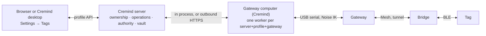

# Simple device setup (protocol v2, Cremind Connect)

This document is **normative** for protocol v2 and for the setup flow that lets
a person with pre-flashed hardware open Cremind's **Settings → Tags**, connect a
USB gateway, pair bridges and tags from their labels, and keep receiving
updates after every window is closed — with no Git, Python, `uv`, terminal,
firmware flashing or copied connector secrets.

Protocol v1 ([protocol.md](protocol.md)) stays in force for everything this
document does not change: framing, credits, retained events, delivery,
layouts, the bridge ↔ tag frame session. Numeric identifiers live in
[`protocol/spec.yaml`](../protocol/spec.yaml) (generated into
`include/ctag/proto_ids.h` and Cremind's `app/tags/runtime/protocol/ids.py`); byte-exact
vectors in `protocol/fixtures/v2_*.json`.

The gateway host — the program a gateway is plugged into, running one worker
per server, profile and gateway — was first the separate **Cremind Connect**
(§11). Cremind now fills that role itself: the Cremind server's own computer,
or a Cremind desktop app set up as a gateway computer for a server elsewhere
(outbound HTTPS only), runs the same workers with the same flows and
credentials. Cremind Connect is retired; its workers move into Cremind as
they are, keys and pairings included. §11 remains the reference for what it
left on a computer.



Contents: [1 Terms](#1-terms) · [2 Identity and labels](#2-identity-and-labels) ·
[3 Cryptography](#3-cryptography) · [4 Ownership on devices](#4-ownership-on-devices) ·
[5 Serial v2](#5-serial-v2) · [6 Mesh v2](#6-mesh-v2) · [7 BLE v2](#7-ble-v2) ·
[8 Flows](#8-flows) · [9 Cremind APIs](#9-cremind-apis) ·
[10 Recovery vault](#10-recovery-vault) · [11 Cremind Connect](#11-cremind-connect) ·
[12 States and errors](#12-states-and-errors) · [13 Release gates](#13-release-gates)

---

## 1. Terms

| Term | Meaning |
|---|---|
| **Connect** | The per-OS-user background service (`cremind-connect`), a PyInstaller bundle of the companion. Bundled with Cremind desktop; offered as a graphical installer to browser users. |
| **Worker** | One isolated companion daemon inside Connect for exactly one *(Cremind server installation, profile, gateway)*. Own database, credentials, controller key, logs. A Cremind **private companion** row is the server side of a worker. |
| **Controller key** | The worker's X25519 static key; the Noise initiator key toward its devices. |
| **Installation key** | Connect's Ed25519 key identifying the Connect installation (one per OS user). Signs setup requests. |
| **Authority** | The Cremind server installation's Ed25519 key. Signs every ownership change (a **grant**). Devices pin it. |
| **Owner** | The profile's immutable UUID (`profiles.id`), 16 bytes on the wire. A profile deleted and recreated under the same name is a different owner. |
| **Binding** | Cremind's record of one physical v2 device: canonical identity, owner, worker, generation, pairing state. |
| **Generation** | A device's ownership counter (u32). Every ownership change (claim, pair, recover, rekey, release) moves it from `g` to `g+1`; devices refuse anything that does not start at their current value. Never decreases, not even across release or factory reset. |
| **Legacy shared** | Every companion registered by an admin before v2 (`mode = legacy_shared`). Unchanged v1 behaviour, admin hardware pages, manual credentials. |

Only v2 firmware (`IDENTIFY` answers `proto ≥ 2`) takes part in this flow. A
v1 device that answers `HELLO` over USB is never offered as a v2 gateway.

---

## 2. Identity and labels

### 2.1 Device identity

Every v2 device generates an **identity key** `ik` (X25519) with its hardware
RNG on its first boot and keeps the private half in internal flash; it is
never exported.

```
device_id = SHA-256("cremind-tag/v2/device-id" ‖ role u8 ‖ ik_pub)[0:16]
short_id  = u32le(device_id[0:4]); if short_id ∈ {0, 0xFFFFFFFF}: short_id ^= 0x5A5A5A5A
```

- `device_id` is the canonical identity everywhere (Cremind bindings, revocations,
  the vault, the worker's inventory). COM ports, USB paths, serial numbers and
  computer names are observations, never identities.
- A v2 tag's `tag_id` (advertising, v1 frame sessions, assignments) **is** its
  `short_id`.
- A v2 bridge's mesh device UUID **is** its `device_id`.
- Roles: `GATEWAY` 1, `BRIDGE` 2, `TAG` 3 (`node_roles`).

### 2.2 Setup secret and setup code

Bridges and tags carry a **setup secret**: 10 random bytes chosen at the
factory (80 bits). The label shows it as a QR code and as a typed **setup code**.

```
payload (15 B) = (0x20 | role) u8 ‖ short_id u32le ‖ setup_secret[10]
code           = base32_crockford(payload)  (24 symbols v0..v23, big-endian bit order)
                 ‖ check symbol c = Σ α^(i+1) · v_i over GF(32), modulus x⁵+x²+1 (0x25), α = 2
display        = 25 symbols in five groups of five: K3F9Z-2ZQMA-7H0W1-QDXPB-4TNC8
QR text        = "CTAG:" ‖ code (25 symbols, no dashes)
```

Alphabet `0123456789ABCDEFGHJKMNPQRSTVWXYZ`. The check catches every single
mistyped symbol and every swap of two neighbouring symbols. Parsers
upper-case, drop spaces and dashes, map `O→0`, `I→1`, `L→1`, refuse `U`,
accept an optional `CTAG:` prefix, and check length (25), the check symbol,
the first byte's version nibble (2) and the role the caller asked for. The
gateway has no setup code: its first owner is established over direct USB
(§8.1).

The setup secret is a pairing credential only. It is never an operational key,
never logged, and Cremind keeps it encrypted (§10.2) only while an operation
needs it.

### 2.3 Factory contract

"Pre-flashed and ready" means **all** of the following (checked by `cremind tags tools
factory …`, §11.8):

| Item | Gateway | Bridge | Tag |
|---|---|---|---|
| v2 application firmware for its role | ✓ | ✓ | ✓ |
| Identity key generated on the device, public half recorded | ✓ | ✓ | ✓ (copied to `UICR.CUSTOMER[8..16]`) |
| Setup secret + printed QR/code label | – | ✓ (factory command over USB) | ✓ (UICR v2 blob) |
| Verified panel configuration | – | – | ✓ (board qualified) |
| Font pack installed and verified | – | ✓ | – |
| Documented reset/recovery procedure | ✓ | ✓ | ✓ |

---

## 3. Cryptography

Primitives: X25519, Ed25519, ChaCha20-Poly1305, SHA-256, HMAC-SHA256,
HKDF-SHA256. Firmware uses the generated **Noise\*** implementation with its
verified **HACL\*** primitives (§3.7); Connect and Cremind use `cryptography`
(OpenSSL). Neither side implements a primitive itself.

### 3.1 Authority and grants

Cremind creates one authority per installation: an Ed25519 key, its id
`authority_id = SHA-256(authority_pub)[0:16]`, and a random installation UUID.
A **grant** authorises exactly one ownership change of one device:

```
grant = canonical CBOR map {
   0: 2,               # version
   1: op,              # grant_ops: CLAIM 1, RECOVER 2, PAIR 3, REKEY 4, RELEASE 5, MAINT 6
   2: device_id,       # bstr 16
   3: role,            # u8
   4: authority_pub,   # bstr 32
   5: owner,           # bstr 16 (profile UUID)
   6: controller,      # bstr 32 (the worker's X25519 public key)
   7: gen_from,        # u32 = the device's current generation
   8: gen_to,          # u32 = gen_from + 1
   9: challenge        # bstr 16, fresh from the device (IDENT)
}
sig = Ed25519(authority_sk, "cremind-tag/v2/grant" ‖ grant)
```

Canonical CBOR: definite lengths, shortest integers, keys ascending. A device
accepts a grant only when **every** rule holds:

1. version 2, `device_id` and `role` are its own;
2. `challenge` equals its current challenge, which it then discards
   (single use; a new one is drawn after every grant check and every reboot);
3. `gen_from` equals its stored generation and `gen_to = gen_from + 1`;
4. `controller` equals the Noise initiator static key of the session carrying it;
5. the signature verifies under `authority_pub`;
6. owned device: `authority_pub` and `owner` equal the pinned ones;
   unowned device: the op is its first-ownership op (`CLAIM` for a gateway,
   `PAIR` for a bridge or tag) and, for bridges and tags, the setup proof (§3.3)
   verifies;
7. the op is allowed in its state (§4).

Noise authentication alone never authorises a command. Devices keep no clock:
freshness comes from the single-use challenge and the generation.

### 3.2 Noise profile

`Noise_IK_25519_ChaChaPoly_SHA256`. Initiator: a worker (static = its
controller key). Responder: the device (static = `ik`, known to the initiator
from `IDENT` or from its binding).

```
prologue = "cremind-tag/v2" ‖ link u8 (1 = serial, 2 = mesh tunnel) ‖ device_id
msg1 payload = empty    msg2 payload = empty
```

After `Split()`, every **secure message** is one transport message whose
plaintext is `type u8 ‖ flags u8 ‖ request_id u16le ‖ CBOR map` (the serial
message catalogue, §5). Nonces are implicit and strictly sequential per
direction: any message that fails to decrypt ends the session, and the
initiator opens a new one (requests are retried with the same `op_id`).

### 3.3 Setup proof (first pairing of a bridge or tag)

```
k_setup = HKDF-SHA256(IKM = setup_secret, salt = "cremind-tag/v2/setup", info = device_id, L = 32)
proof_s = HMAC(k_setup, "S" ‖ h ‖ SHA-256(grant))[0:16]      # worker -> device, in PAIR
proof_d = HMAC(k_setup, "D" ‖ h ‖ proof_s)[0:16]             # device -> worker, in the PAIR answer
```

`h` is the Noise handshake hash. `proof_s` binds the physical label to the
proposed authority, owner, controller and this session; `proof_d` proves the
device on the other end holds the label's secret. Three wrong proofs in a row
make a tag skip its next wake window (anti-brute-force pacing, as v1). A
bridge needs no pacing of its own: its `PAIR` endpoint is reachable only
through a mesh it joined with the label's static OOB (§3.4), and `MAINT_AUTH`
only over its USB port.

### 3.4 Mesh static OOB (bridges)

```
static_oob = HKDF-SHA256(IKM = setup_secret, salt = "cremind-tag/v2/mesh-oob", info = device_id, L = 32)
```

Bridges and gateways build with `CONFIG_BT_MESH_OOB_AUTH_REQUIRED=y` and
`CONFIG_BT_MESH_ECDH_P256_HMAC_SHA256_AES_CCM=y`; the bridge offers only
static OOB (32 bytes), the gateway provisions only with the value the worker
supplies, and any other authentication method is refused. There is no
fallback to unauthenticated provisioning. A provisioning that fails its
authentication (a wrong or missing static OOB) ends `EVT_PROVISIONED
{status: SECURITY_CONFIG, addr: 0}` — final, never retried as a timeout.

### 3.5 Operational keys

| Key | Holder | Use |
|---|---|---|
| Tag **operational root** `root` (32 B) | tag (NVS), worker, vault | `K_epoch` v2 below |
| Bridge **maintenance key** `mk` (32 B) | bridge (settings), worker, vault | authenticates USB maintenance of an owned bridge (§5.4) |
| Controller key (X25519) | worker (+ vault) | Noise initiator |
| Mesh net/app/device keys | gateway (CDB), bridges | mesh (unchanged) |

```
K_epoch (v2) = HKDF-SHA256(IKM = root, salt = "cremind-tag/v2/epoch", info = "K_epoch" ‖ tag_id u32le ‖ epoch u32le, L = 16)
```

The v1 frame session (protocol.md §5.4–5.6) is unchanged; only the key it runs
on comes from the rotatable root instead of the immutable enrollment secret. A
rekey therefore invalidates every key a bridge (or a former computer) held.

### 3.6 Proofs of held keys

```
root_proof  = HMAC(root, "cremind-tag/v2/root-proof" ‖ h)[0:16]   # tag STATUS answer when owned
maint_proof = HMAC(mk,   "cremind-tag/v2/maint" ‖ h)[0:16]        # worker -> bridge, MAINT_AUTH
```

`root_proof` lets a worker learn, after a lost acknowledgement, which root a
tag actually committed (its staged new one or the previous one).

### 3.7 Firmware integration

- Noise\*: `noise-all/api-IK/IK_25519_ChaChaPoly_SHA256` vendored under
  `lib/third_party/noise_ik/` with HACL\* `Hacl_Curve25519_51` (portable; the
  generated code's `Hacl_Curve25519_64` calls are mapped to it on ARM),
  `Hacl_Chacha20Poly1305_32`, `Hacl_Hash_SHA2`, `Hacl_HMAC`, and `Hacl_Ed25519`
  for grant verification.
- Allocation is bounded: KaRaMeL's `KRML_HOST_MALLOC/FREE` map to a fixed
  `sys_heap` (`CONFIG_CTAG_SECURE_HEAP_SIZE`); a failed allocation fails the
  session, never the device.
- Randomness: `Lib_RandomBuffer_System_crypto_random` → `sys_csrand_get()`.
- Keys and intermediate secrets are wiped (`Lib_Memzero0_memzero`) after use.
- Resource fit (flash, RAM, stack) is a release gate (§13). A board that does
  not fit stays on protocol v1; authentication is never weakened to fit.

---

## 4. Ownership on devices

### 4.1 Records

| Device | Record (one atomic write) | Contents |
|---|---|---|
| Gateway | settings `ctag/gw/own` | `version, state, gen, authority_pub, owner, controller, crc` |
| Bridge | settings `ctag/br/own` | `version, state, gen, authority_pub, owner, controller, mk, crc` |
| Tag | NVS id 5 | `version, state, gen, authority_pub, owner, root, override_secret[10], crc` |

`state`: `0 UNOWNED` (factory), `1 OWNED`, `2 RELEASED` (a released tag with a
fresh setup secret in `override_secret`; pairs like `UNOWNED` but with that
secret, never the label's). A write that fails leaves the previous record; a
record with a bad CRC or version is treated as `UNOWNED` **with its generation
kept** from the separately stored generation floor (NVS id 6 / `ctag/*/genf`),
so corruption can never rewind a generation.

### 4.2 What each state allows

| Link, state | Allowed |
|---|---|
| Any, plaintext | `HELLO`, `PING`, `IDENTIFY`, `SECURE_OPEN`, `SECURE_DATA` |
| Gateway, unowned session | `INFO`, `PING`, `STATUS`, `CLAIM` |
| Gateway, owned, session from the pinned controller | everything (v1 catalogue + v2) |
| Gateway, owned, other controller | `INFO`, `PING`, `STATUS`, `RECOVER` |
| Bridge/tag, unowned or released | `STATUS`, `PAIR` |
| Bridge/tag, owned, any controller with a grant (the grant names the controller; a recovery rekeys from a new one) | `STATUS`, `REKEY`, `RELEASE`; bridge USB maintenance port only: `MAINT_AUTH`, then `RECOMMISSION` |

Everything else answers `AUTH_REQUIRED` (no session) or `NOT_OWNER` (session,
not permitted). A v1 request sent in plaintext to a v2 gateway answers
`AUTH_REQUIRED`. The first ownership of a gateway is possible **only** over its
own USB port while unowned; once owned, another computer cannot replace the
owner by sending `CLAIM` again (`NOT_OWNER`).

### 4.3 Factory reset

A physical operation, documented per board, never reachable over a radio or
from software: gateway/bridge — hold the board button through power-up for
10 s (LED fast blink, then solid); tag — a full chip erase and re-flash over
SWD. It clears ownership, mesh state and assignments, keeps the identity key
and **keeps the generation**, and on a bridge/tag re-arms the label's factory
setup secret.

---

## 5. Serial v2

Framing, credits, idempotency and retained events are protocol.md §1 and §10
unchanged. New plaintext messages:

| Type | Name | Request → response |
|---|---|---|
| 0x06 | `IDENTIFY` | `{}` → `{status, proto, role, device_id, ik, fw, build, board, owner_state, gen, authority_id?, challenge}` |
| 0x07 | `SECURE_OPEN` | `{data: noise msg1}` → `{status, data: noise msg2}`; replaces any session |
| 0x08 | `SECURE_DATA` | `{data: ciphertext}` carrying one secure message (§3.2), both directions |

`challenge` is drawn fresh by every `IDENTIFY`, `STATUS` and `IDENT` read,
valid until the next draw, grant check
or reboot. `authority_id` is present when owned. `HELLO` drops the secure
session; after `SECURE_OPEN` succeeds the device re-sends its retained events
inside it. The outer frame of `SECURE_DATA` has `request_id = 0`, `flags = 0`;
the inner header is authoritative. Credits count outer frames.

### 5.1 Secure messages (inside a session)

| Type | Name | Payload → answer | Roles |
|---|---|---|---|
| 0x09 | `CLAIM` | `{grant, sig}` → `{status, gen}` | gateway |
| 0x0A | `RECOVER` | `{grant, sig}` → `{status, gen}` | gateway |
| 0x0B | `RELEASE` | `{grant, sig, release_stage}` → `{status, gen, data?}` | all |
| 0x0C | `STATUS` | `{}` → `{status, owner_state, gen, authority_id?, owner?, controller_match, challenge, root_proof?}`; `owner` (a profile id) only to the pinned controller | all |
| 0x0D | `PAIR` | `{grant, sig, proof, op_key}` → `{status, gen, proof}` | bridge (`op_key` = `mk`), tag (`op_key` = `root`) |
| 0x0E | `REKEY` | `{grant, sig, op_key}` → `{status, gen}` | bridge (new `mk`, new controller), tag (new `root`) |
| 0x0F | `MAINT_AUTH` | `{proof}` → `{status}` | bridge maintenance port only (`NOT_OWNER` in a tunnel session) |
| 0x17 | `RECOMMISSION` | `{grant?, sig?}` → `{status, gen, data}` | bridge maintenance port only: owned (after `MAINT_AUTH`, a `MAINT` grant) or released; leaves the mesh, returns a fresh setup payload. An unowned bridge answers `INVALID` (its label stays valid) |
| 0x66 | `FACTORY_SETUP` | `{data}` → `{status}` | bridge maintenance port (plaintext or in a session), unowned, no secret yet: store the 10-byte setup secret (`LOCKED` afterwards) |

`RELEASE` on a tag is two-stage, each stage with its own grant (same
`gen_from`, a fresh challenge): `release_stage 0` (prepare) stores a fresh
setup secret as pending for that controller and returns `data` = its setup
payload (§2.2); the worker shows it as the tag's last screen (a QR and the
code) through a normal delivery; `release_stage 1` (commit, same controller)
wipes the owner, the root and assignments and makes the fresh secret the only
one the tag accepts (`RELEASED`). A `REKEY` abandons a prepared release (its
stage 1 can no longer follow). A released tag keeps its stored epoch: its next
owner assigns at or above it — a lower epoch answers `STALE_EPOCH` with the
stored one, and the worker assigns again above it (the root changed, so frames
of the previous owner can never authenticate again). A gateway `RELEASE` wipes
its mesh, CDB and assignments (`UNOWNED`, generation kept) and reboots. A
bridge `RELEASE` leaves the mesh and **locks** pairing until it is
recommissioned over local USB.

### 5.2 v2 operational messages (owned gateway, pinned controller)

| Type | Name | Payload → answer |
|---|---|---|
| 0x11 | `PROVISION` | v2 adds `static_oob` (bstr 32, **required** for v2 bridges) |
| 0x16 | `DISCOVER` | `{op_id, bridge (0 = all), duration_s ≤ 120, tag_id (0 = any)}` → `ACCEPTED`; `EVT_DISCOVERED`s |
| 0x33 | `TUNNEL_OPEN` | `{op_id, bridge, tag_id (0 = the bridge itself), duration_s}` → `{status: OK, tunnel}` (`BUSY` while the bridge holds another tunnel); `EVT_TUNNEL`s; idle tunnels close after `duration_s` + 5 s |
| 0x34 | `TUNNEL_SEND` | `{tunnel, data ≤ 400}` → `{status}`; one message per tunnel in flight (`BUSY` until it is through the mesh: retry), `TOO_LARGE` above 400 bytes |
| 0x35 | `TUNNEL_CLOSE` | `{tunnel}` → `{status}` |
| 0x8A | `EVT_TUNNEL` | `{tunnel, bridge, tag_id, state (OPEN 1, DATA 2, CLOSED 3), data?, status?}` (not retained) |
| 0x8B | `EVT_DISCOVERED` | `{bridge, tag_id, rssi, flags}` (not retained; at most one per tag and bridge per 5 s) |

`ASSIGN_TAG`'s `key` is `K_epoch` v2 for v2 tags. Keys only ever travel inside
a secure session.

### 5.3 CBOR keys (v2 additions)

`device_id 64, ik 65, owner_state 66, gen 67, authority_id 68, challenge 69,
grant 70, sig 71, static_oob 72, tunnel 73, state 74, proof 75, owner 76,
controller_match 77, root_proof 78, release_stage 79, op_key 80`.

### 5.4 Bridge maintenance port v2

Same framing and the same secure layer. An unowned bridge answers the v1
maintenance catalogue in plaintext (the factory installs fonts before it is
labelled). An owned bridge answers `FONT_*`, `FLASH_TEST`, `REBOOT` only inside
a session that passed `MAINT_AUTH` (`maint_proof` with its `mk`).

---

## 6. Mesh v2

- **Provisioning**: static OOB only (§3.4). The unprovisioned beacon carries the
  v2 bridge's `device_id` as its UUID and OOB information "on box". The
  gateway sets the value in its `capabilities` callback
  (`bt_mesh_auth_method_set_static`) and fails provisioning with
  `SECURITY_CONFIG` if the bridge does not offer static OOB.
- New vendor opcodes on the existing models:

| Op | Name | Dir | Fields |
|---|---|---|---|
| 0x1A | `TUNNEL_OPEN` | G→B | `tunnel u16, tag_id u32, timeout_s u8` |
| 0x1B | `TUNNEL_DATA` | G→B | `tunnel u16, seq u8, flags u8 (bit0 START, bit1 END), data ≤ 150` |
| 0x1C | `TUNNEL_CLOSE` | G→B | `tunnel u16, status u8` |
| 0x1D | `DISCOVER` | G→B | `duration_s u8, tag_id u32` |
| 0x1E | `DISCOVERED` | B→G | `tag_id u32, rssi i8, flags u8` |
| 0x1F | `CAPS2_STATUS` | B→G | `device_id[16], gen u32, owner_state u8` (answer to `CAPS_GET` from a v2 bridge, after `CAPS_STATUS`) |
| 0x20 | `TUNNEL_UP` | B→G | `tunnel u16, seq u8, flags u8 (bit0 START, bit1 END, bit7 CLOSE: data = status u8), data ≤ 150` |

- A tunnel with `tag_id = 0` ends at the bridge's own secure endpoint; any other
  `tag_id` is relayed to that tag's `PAIR` characteristic (§7). The **first**
  message up a tunnel is the endpoint's `ident2` (serial `EVT_TUNNEL{OPEN}`);
  every later one is a `kind | body` message (`PairKind`). A bridge holds one
  tunnel at a time; it closes a new one with `BUSY` while one is open or a
  frame session runs. Idle tunnels close after `timeout_s`. Fragments are
  sent as acknowledged segmented messages under the gateway's
  one-outstanding-segmented-send rule; a gap ends the message (the Noise
  session above it then fails and is opened again).
- **Discovery** reports only v2 tags advertising setup mode (§7.1), never
  assigned tags; discovery results are candidates, not inventory.

---

## 7. BLE v2

### 7.1 Advertising

Manufacturer data keeps the v1 layout with `ver = 2` and new flag bits:
bit3 **setup** (unowned or released: pairing possible), bit4 **owned**. An
owned v2 tag advertises exactly as v1 otherwise.

### 7.2 GATT

| Characteristic | Short | Props | Value |
|---|---|---|---|
| `IDENT` | 0x0006 | read (long) | `ident2` struct (91 bytes): `proto, role, device_id[16], ik[32], owner_state, gen u32, authority_id[16] (zeros when unowned), challenge[16], board, fw_major, fw_minor, fw_patch` |
| `PAIR` | 0x0007 | write, indicate | fragmented secure-endpoint messages (same fragment header as `CTRL`), ≤ `PAIR_MSG_MAX` (320) |

A `PAIR` message is `kind u8 ‖ body`: `1` Noise msg1/msg2, `2` transport
message, `3` close `{status}`. The tag reuses its record buffers for a pairing
session (never at the same time as a frame session) and ends it after
`TAG_SESSION_TIMEOUT_MS` without progress. A new `challenge` is drawn per
connection.

---

## 8. Flows

Every flow is an **operation** in Cremind (§9.4). Durability rule for every
key transition: *stage locally and in the vault → configure the device with a
durable operation id → reconcile → commit in Cremind → verify readiness →
enable content.*

### 8.1 First gateway connection

1. The person plugs the gateway in and clicks **Connect gateway**.
2. The page creates a setup session (`POST /api/tags/setup-sessions`) and opens
   its `cremind-connect://setup?…` link (Electron: over IPC). If no Connect
   binds within 8 s the page offers the installer for the browser's OS and a
   **Continue after installation** action that re-opens the link.
3. Connect binds the session with its installation key and shows its native
   window: server, profile, computer, the attached gateway(s) (a sole compatible
   one preselected; v1 or already-owned-elsewhere gateways listed as not
   usable) and a four-word **verification phrase**. The page shows the same
   phrase and asks the person to confirm it matches.
4. After **both** the native approval and the browser confirmation, Connect
   generates the worker's controller key and two credential secrets, and
   redeems the session with their hashes. Cremind creates the private companion,
   the credentials (by hash), the gateway binding (`pairing`) and a
   `claim_gateway` operation, and answers the ids. A repeated redemption returns
   the same ids.
5. The worker starts, opens the port, `IDENTIFY` → challenge, asks Cremind for
   a `CLAIM` grant, opens a Noise session, sends `CLAIM`. A lost answer is
   reconciled from `STATUS` (owned by our authority at `gen_to`).
6. Cremind marks the binding `paired`; the first authenticated heartbeat after
   the claim marks it `ready` and the session `completed`. The page shows
   **Gateway connected** and **Add bridge**.

Unplugging and re-plugging the gateway needs no new flow: the worker finds it
again by `device_id` on whatever port it appears.

### 8.2 Bridge pairing

1. **Add bridge** → gateway choice (required when there are several) → scan the
   QR, upload a picture of it, or type the code.
2. `POST /api/tags/discovery {role: bridge, gateway, setup_code}`: the worker
   scans unprovisioned beacons for the code's `short_id`.
3. `POST /api/tags/pairings {discovery, candidate}`: the worker stages `mk` (vault
   `pending`), provisions with the derived static OOB, configures the node,
   opens a tunnel to the bridge's own endpoint, takes `IDENT`, asks for a `PAIR`
   grant, runs Noise, sends `PAIR {grant, sig, proof_s, mk}`, checks `proof_d`,
   reads `CAPS_STATUS` (font pack id must equal the worker's pack), commits the
   vault entry and reports. Any failure after provisioning removes the node
   again (`REMOVE_NODE`); the bridge never carries content before `ready`.
4. The page shows **Bridge ready** (or "This bridge needs a font update" with the
   USB procedure).

### 8.3 Tag pairing

1. **Add tag** → scan or type the code.
2. `POST /api/tags/discovery {role: tag, setup_code}`: every ready bridge of the
   profile listens for the code's `tag_id` in setup mode. "Waiting for the tag to
   wake" is normal: a tag advertises every 30 s.
3. Candidates are bridges with room; the strongest recent signal among them is
   recommended. With exactly one eligible bridge the page proceeds directly;
   otherwise it shows the choice before **Pair**.
4. The worker stages `root` (vault `pending`), opens a tunnel through the chosen
   bridge, takes `IDENT`, asks for a `PAIR` grant, runs Noise, sends `PAIR`,
   checks `proof_d`, then assigns the tag (`ASSIGN_TAG`, epoch above the tag's
   stored epoch, `K_epoch` v2) and sends `CLEAR`. **Ready** only after the tag's
   authenticated clear acknowledgement (`EVT_RESULT OK`).
5. First successful setup of a profile's first tag turns on "Send this profile's
   activity" by default (a switch on the success step); re-pairing or recovering
   existing hardware keeps the current preference. **Send test** delivers a
   pinned test card.

### 8.4 Recovery on a replacement computer

1. Install Connect, sign in to the same profile, plug in the existing gateway.
2. **Recover on this computer** on the gateway → `POST /api/tags/recoveries`
   creates a `recover` setup session; Connect binds it and verifies the attached
   gateway's `device_id` matches the binding and takes a fresh challenge.
3. The person confirms (native window + phrase in the browser).
4. Atomically, Cremind revokes the old worker's credentials and lease, moves the
   binding generation forward and holds delivery, creates the new worker
   credentials for the **same** companion, and opens a `recover_gateway`
   operation.
5. The new worker gets the vault state (bridges' `mk`, tags' roots, generations,
   assignments, epoch floors) straight from Cremind, sends `RECOVER` (grant) to
   the gateway, then `REKEY`s every bridge (new controller, new `mk`) through
   mesh tunnels and every tag (new root) through its bridge, re-assigns and
   clears each tag. Old sessions and queued commands are refused by the devices
   (generation / controller / root changed).
6. A sleeping or unreachable device stays **Recovery pending**; Cremind never
   claims its old keys are gone before it acknowledges.

Account recovery assumes the Cremind server and its vault survive. A server that
lived only on the lost computer must first be restored from a protected backup
(§10.4).

### 8.5 Gateway replacement

A copied mesh database is never restored (replay counters; an old gateway may
still be alive). **Replace gateway**: pair the new gateway (§8.1, as the same
profile), then for each bridge: connect it to this computer by USB, `MAINT_AUTH`
with its recovered `mk`, `RECOMMISSION` (grant) — it leaves the old mesh and
returns a fresh setup code — then pair it into the new mesh (§8.2) keeping its
fonts, then re-assign and rekey its tags.

### 8.6 Pause, unplug, remove

| Action | Result |
|---|---|
| Unplug gateway | pairing kept; **Offline**; automatic reconnect |
| Close browser / quit desktop | Connect continues |
| Pause (tag) | no new deliveries for it; pairing kept |
| Pause (gateway) | the worker starts no new work (lease answers `paused`) |
| Remove tag | content revoked at once; worker clears the screen, `RELEASE` (fresh code shown on the tag), unassigns |
| Remove bridge | affected tags listed; their delivery blocked until reassigned or removed; worker removes the node |
| Remove gateway | the whole private hierarchy revoked; worker releases tags, removes bridges, releases the gateway, then its credential is revoked |
| Delete profile | its workers revoked; cleanup and tombstones kept |

Server access is revoked immediately; physical cleanup needs reachable
hardware and shows **Removal pending** until it finishes. Before draining its
queue after a reconnect, a worker reconciles generations and revocations
(`GET state`). Ordinary removal never re-activates a label's factory secret;
bridges and gateways are recommissioned through approved local USB; physical
factory reset (§4.3) is separate.

---

## 9. Cremind APIs

### 9.1 Profile API (JWT; everything scoped to the caller's profile)

| Method | Path | Purpose |
|---|---|---|
| GET | `/api/tags/connections` | the profile's gateways/workers, their computers, status, attached bridges and tags |
| POST | `/api/tags/setup-sessions` | `{operation: connect_gateway\|recover\|probe, server_url, companion_id?, idempotency_key}` |
| GET | `/api/tags/setup-sessions/{id}` | durable progress |
| POST | `/api/tags/setup-sessions/{id}/confirm` | browser confirmation of the bound computer/gateway |
| DELETE | `/api/tags/setup-sessions/{id}` | cancel an incomplete session |
| POST | `/api/tags/discovery` | `{role, gateway_id?, setup_code, idempotency_key}` bounded scan |
| GET | `/api/tags/discovery/{id}` | candidates, recommendation |
| POST | `/api/tags/pairings` | `{discovery_id, candidate_id, bridge_id?, name?, idempotency_key}` |
| GET / DELETE | `/api/tags/pairings/{id}` | progress / cancel and reconcile |
| POST | `/api/tags/devices/{id}/unpair` | revoke access, begin cleanup |
| POST | `/api/tags/devices/{id}/pause`, `/resume` | pause delivery |
| POST | `/api/tags/devices/{id}/test` | send a test card |
| POST | `/api/tags/recoveries` | `{companion_id, server_url, idempotency_key}` |
| GET | `/api/tags/recoveries/{id}` | recovery/rekey progress per device |
| GET | `/api/tags/connect` | installer links per OS, the latest Connect version |

Every mutation takes an `Idempotency-Key` header (or `idempotency_key` field):
a retry with the same key and body returns the original answer. Errors keep
Cremind's `{error, message, detail, …}` shape.

### 9.2 Bootstrap API `/api/tag-setup/v1/` (setup capability only)

Authenticated by `Authorization: CremindSetup <session_id>.<token>` (the token
from the link; Cremind stores its SHA-256) **and**, after `bind`, an Ed25519
`proof` by the bound installation key over
`"cremind-connect/v1/" ‖ action ‖ 0x00 ‖ session_id ‖ 0x00 ‖ server_nonce ‖ 0x00 ‖ SHA-256(canonical body)`.
These credentials never authorise anything else, and connector or JWT
credentials are refused here.

| Method | Path | Purpose |
|---|---|---|
| POST | `sessions/{id}/bind` | `{installation: {id, public_key, computer, platform, version}}` → server, profile, operation, phrase, `server_nonce`, authority |
| GET | `sessions/{id}` | state (waiting for confirmation, cancelled, …) |
| POST | `sessions/{id}/approve` | `{gateway: {device_id, ik, fw, proto, owner_state, gen, challenge}, proof}` |
| POST | `sessions/{id}/redeem` | `{controller_pub, credentials: {hardware_sha256, content_sha256}, proof}` → `{companion_id, credentials: {hardware_id, content_id}, operation_id, authority}` |
| POST | `sessions/{id}/fail` | `{code, message}` shown in the browser |

Sessions: 5 minutes, single use, bound to the installation identity, the
initiating profile (name + UUID) and JWT, Connect's key, the selected gateway,
fresh challenges and the requested operation. Cancel, expiry or a changed
gateway invalidates them. After redemption, closing the browser or signing
out cancels nothing; Pause, Remove or credential revocation stop background
access.

### 9.3 Connector additions `/api/tag-connector/v1/` (worker credentials)

| Method | Path | Purpose |
|---|---|---|
| GET | `whoami` | + `api_version: 2`, `capabilities`, `mode`, `worker {generation, state, paused}` |
| POST | `lease` | renew the 60 s authorization lease (every 20 s) → `{expires_at, ttl_s, renew_s, paused, state, generation}` |
| GET | `state` | bindings `{device_id, role, gen, state, paused}` and revoked `device_id`s |
| GET | `operations/{id}` | operation details (+ the setup secret while it is needed) |
| POST | `operations/{id}/progress` | `{stage, candidates?, device?, error?}` |
| POST | `grants` | `{operation_id, device_id, op, gen_from, challenge}` → `{grant, sig}` |
| PUT | `vault/{device_id}` | `{expected_version, state, stage: pending\|committed}` → `{version}` (compare-and-swap) |
| GET | `vault` | the worker's vault state (recovery only, §10.3) |

Operations reach the worker as commands `run_operation {operation_id, kind}`
on the existing long-poll queue. A private worker's `inventory` only updates
telemetry of devices it already has bindings for; reported unknown devices are
ignored (an inventory report never grants pairing). Its hardware credential
never sees other profiles' names or devices.

### 9.4 Operations

`claim_gateway`, `discovery`, `pair_bridge`, `pair_tag`, `unpair`,
`recover_gateway`, `release_gateway`, `recommission_bridge`. Each has a stage,
a durable id used as the device `op_id` seed, retry state and a terminal
outcome (`succeeded`, `failed {code}`, `cancelled`, `pending_device`).
Cancelling one mid-way reconciles: a provisioned but unbound bridge is removed,
a tag whose `PAIR` may have committed is probed with `STATUS` (`root_proof`)
and either kept (pairing completes) or left unowned.

---

## 10. Recovery vault

### 10.1 What it holds

Per device binding: public identity, generation, pinned authority/owner,
tag roots, bridge `mk`, assignments (bridge, epoch), epoch floors, font pack
id. Never controller keys (a recovery installs a new one), device private identity keys,
never connector credentials.

### 10.2 Encryption at rest

- A fresh AES-256-GCM data key and 12-byte nonce per saved version; associated
  data = `profile_uuid ‖ device_id ‖ generation ‖ version` (canonical JSON).
- The data key is wrapped (AES-KW, RFC 3394) under the versioned **master key**,
  a 32-byte file under `<SYS>/tags/authority/` with owner-only permissions,
  outside the database, excluded from ordinary backups and from every file API.
- Setup secrets of running operations are sealed the same way.
- Only the worker that currently holds the binding (and its current generation)
  can write; `expected_version` compare-and-swap refuses stale or concurrent
  uploads.
- Encrypted records present but the master key missing → recovery fails with
  `recovery_key_unavailable`. A replacement key is never generated over
  existing vault data.

### 10.3 Delivery

The vault is decrypted only for an authorised recovery of the owning profile
and delivered directly to the recovering worker (`GET vault` works only for a
worker whose companion is in `recovering` state, once).

### 10.4 Backups and restore

- Ordinary backups exclude the authority and master keys. An **encrypted**
  backup (passphrase) may include them when explicitly requested
  (`include_tag_recovery_authority`).
- A restore keeps the current installation's revocations and highest
  generations (max of archive and local), cancels restored incomplete setup
  sessions, operations and leases, and marks restored bindings
  `reconciling` until their worker reports live generations and epochs.

---

## 11. Cremind Connect

Retired: Cremind's gateway computers run the workers now (see the
introduction). What follows describes the program as it shipped — the
directories, IPC and startup registration Cremind reads when it takes a
computer's workers over. Its packaging:
[cremind-connect.md](https://github.com/cremind-ai/cremind/blob/main/docs/tags/cremind-connect.md).

### 11.1 Processes

```
cremind-connect service            per-user supervisor (single instance), IPC server, USB watcher
cremind-connect worker --dir D     one daemon (protocol v2) per worker directory
cremind-connect open <url>         URL handler: forwards to the service, shows the native window
cremind-connect status [--json]    installed version, service state, workers
cremind-connect install|uninstall  startup + URL handler registration (+ udev rules on Linux)
```

### 11.2 Directories

| OS | Data | Application |
|---|---|---|
| Windows | `%LOCALAPPDATA%\Cremind\Connect` | `%LOCALAPPDATA%\Programs\Cremind Connect\<version>` |
| macOS | `~/Library/Application Support/Cremind Connect` | `/Applications/Cremind Connect.app` (or `~/Applications`) |
| Linux | `~/.local/share/cremind-connect` | `/opt/cremind-connect` (.deb) or `~/.local/lib/cremind-connect/<version>` |

Data: `installation.json`, `installation.key` (owner-only), `ipc.key`,
`logs/`, `assets/fonts/<id>/` (verified, read-only, shared), and
`workers/<worker_id>/` with `worker.json`, `controller.key`, `config.toml`,
`companion.sqlite3`, `secrets.json` (file backend, owner-only), `logs/`.

### 11.3 IPC

`multiprocessing.connection` over a named pipe (Windows,
`\\.\pipe\cremind-connect-<user hash>`) or a Unix socket in a `0700` runtime
directory, with a 32-byte authkey from `ipc.key`. No TCP listener, no HTTP.

### 11.4 Launch link

`cremind-connect://setup?v=1&server=<origin>&session=<id>&token=<capability>[&pin=<sha256>]`.
`pin` (optional) is the SHA-256 of the server's CA certificate when Cremind
serves HTTPS with its own CA; Connect then trusts exactly that CA for that
origin. The link grants no hardware access by itself: native approval and
Cremind's confirmation are always required.

### 11.5 Startup

| OS | Mechanism |
|---|---|
| Windows | Scheduled Task "Cremind Connect" (logon trigger, least privilege, restart on failure) running the windowed executable's `service` |
| macOS | LaunchAgent `io.cremind.connect` (`RunAtLoad`, `KeepAlive`) |
| Linux | systemd user unit `cremind-connect.service` (`Restart=always`); udev rule `70-cremind-tag.rules` (`uaccess` for the gateway/bridge VID:PID) installed by the package |

Runs with normal user privileges, restarts after crashes and at logon, resumes
after sleep and USB re-enumeration. The desktop-bundled and standalone copies
install into the same per-user location; the newer version wins, the older
one exits.

### 11.6 Workers

The supervisor maps each attached compatible USB port to a `device_id`
(plaintext `IDENTIFY` on ports no worker holds), starts a worker for every
worker directory whose gateway is attached, and restarts it with back-off if it
exits. A gateway is never opened by two workers (supervisor bookkeeping plus
exclusive open). Only verified, immutable font assets are shared.

### 11.7 Fonts

Connect ships (or downloads and verifies against a pinned SHA-256) the
published **font asset bundle**: the binary font pack, its `fontpack.json`
metadata, the exact source fonts used for shaping, coverage metadata, `NOTICE`
and licences. Fonts are never built on a user's computer.

### 11.8 Factory and development tools

`cremind tags tools factory tag|bridge|gateway` (development/factory stations only):
program firmware and the UICR v2 blob (tags, SWD) or the setup secret (bridges,
USB, unowned only), read back the identity, install and verify the font pack
(bridges), and print the label (PNG with QR + code).

---

## 12. States and errors

Binding states: `pairing`, `paired`, `ready`, `offline` (derived from contact),
`recovery_pending`, `removal_pending`, `reconciling`; a removed device leaves
a **revocation tombstone** (`device_id`, highest generation). Discovery
candidates are never bindings.

New status codes (`status_codes`): `AUTH_REQUIRED 34`, `NOT_OWNER 35`,
`GRANT_INVALID 36`, `STALE_GENERATION 37`, `PROOF_FAILED 38`, `LOCKED 39`.

Operation error codes: `gateway_offline`, `not_found`, `setup_code_invalid`,
`setup_code_rejected`, `device_owned`, `bridge_full`, `fontpack_mismatch`,
`grant_refused`, `timeout`, `cancelled`, `v1_firmware`,
`recovery_key_unavailable`.

---

## 13. Release gates

The simple Settings flow ships only alongside qualified v2 firmware and the
packaged runtime. Until then it is behind the server setting
`tags.simple_setup` (off by default in production builds).

1. Real gateway, bridge and tag authenticate, pair, rekey, clear and reject old
   authority within their resource budgets (`build/memory-report.md`).
2. Noise\*/HACL\* integration reviewed; shared vectors pass in C and Python.
3. Clean installs on Windows x64, macOS arm64 + x64, Linux x64 (systemd) with no
   developer tools; delivery continues after the browser and the desktop app close.
4. Two profiles cannot reach each other's devices through new or legacy APIs.
5. Hema panel pins/controller verified (the placeholder panel refuses every
   frame) before the tag is offered to consumers.
